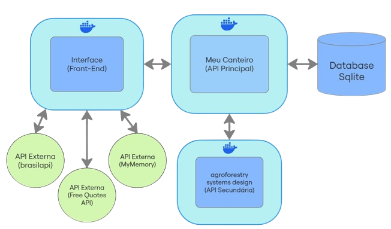

# MVP Canteiro SAF - Front End

## Descrição

Este projeto busca auxiliar no planejamento de sistemas agroflorestais (SAF) que combinem espécies vegetais de diferentes estratos verticais.  
A seleção das espécies que irão compor um SAF é de grande importância para sua eficiência.

O projeto permite ao usuário:

- Inserir/Editar/Excluir espécies do banco de dados;
- Selecionar uma espécie por estrato para criar um canteiro apresentando informações pertinentes para realizar o planejamento, manejo e colheita do SAF;
- Buscar Previsão meteorólogica de até 6 dias de cidades do brasil.

## Arquitetura



- Meu Canteiro Front: [https://github.com/Leandr0SmS/mvp_canteiroSAF_frontend](https://github.com/Leandr0SmS/mvp_canteiroSAF_frontend)
- Meu Canteiro API: [https://github.com/Leandr0SmS/mvp_canteiroSAF_API](https://github.com/Leandr0SmS/mvp_canteiroSAF_API)
- Agroforestry Systems Design API: [https://github.com/Leandr0SmS/agroforestry_systems_design](https://github.com/Leandr0SmS/agroforestry_systems_design)

## Iniciando

### Dependências

Para que o front-end funcione de forma otimizada, será necessário iniciar as APIs:

- [puc_rio-mvp_1-back_end](https://github.com/Leandr0SmS/puc_rio-mvp_1-back_end)
- [agroforestry_systems_design](https://github.com/Leandr0SmS/agroforestry_systems_design)

### Executando

> Caso precise atualizar o URL da API basta modificar o arquivo config.js.

#### Docker

```Docker CLI
    docker build --no-cache -t meu_canteiro_front .
```

```Docker CLI
    docker run -d -p 8080:80 --name meu_canteiro_front meu_canteiro_front
```

Abrir no navegador: [http://localhost:8080/](http://localhost:8080/)

## Previsão do tempo BrasilAPI

Rota utilizada na BrasilAPI foi a /CPTEC que abstrai e normaliza dados provenientes da CPTEC. Fonte oficial: CPTEC/INPE

### Buscar localidades

Retorna listagem com todas as cidades correspondentes ao termo pesquisado junto a seus respectivos códigos presentes nos serviços da CPTEC. O Código destas cidades será utilizado para os serviços de meteorologia e a ondas (previsão oceânica) fornecido pelo centro.
`https://brasilapi.com.br/api/cptec/v1/cidade/{cityName`

### Previsão meteorológica para, até, 6 dias

Retorna a previsão meteorológica para a cidade informada para um período de 1 até 6 dias. Devido a inconsistências encontradas nos retornos da CPTEC nossa API só consegue retornar com precisão o período máximo de 6 dias.
`https://brasilapi.com.br/api/cptec/v1/clima/previsao/{cityCode}/{days}`

### Links Brasil API

- [Termos de uso](https://brasilapi.com.br/#termos-de-uso)
- [Brasil API DOCS](https://brasilapi.com.br/docs)

## Free Quotes API

Utilizada para exibir frases motivacionais ao usuário, oferecendo uma experiência mais leve e inspiradora durante o uso da aplicação

### Links Free Quotes API

- [Free Quotes API DOCS](https://qapi.vercel.app/docs)

## MyMemory Translation Memory technology API

API responsável por traduzir as frases motivacionais para o idioma do usuário, garantindo acessibilidade e uma experiência personalizada.

### Rota

`https://api.mymemory.translated.net/`

| Parâmetro   | Descrição                                                                           | Tipo       | Valor de exemplo |
|-------------|-------------------------------------------------------------------------------------|------------|------------------|
| `q`         | A sentença que você deseja traduzir. Use UTF-8. Máx. 500 bytes                      | Obrigatório| `Hello World!`   |
| `langpair`  | Par de idiomas de origem e destino, separados pelo símbolo `\|`. Use ISO ou RFC3066 | Obrigatório| `en\|it`         |

### Links MyMemory API

- [Termos de uso](https://mymemory.translated.net/terms-and-conditions)
- [MyMemory API DOCS](https://mymemory.translated.net/doc/)

## Autor

[Leandro Simões](https://github.com/Leandr0SmS)

## Licença

The MIT License (MIT)
Copyright © 2023 Leandro Simões

Permission is hereby granted, free of charge, to any person obtaining a copy of this software and associated documentation files (the “Software”), to deal in the Software without restriction, including without limitation the rights to use, copy, modify, merge, publish, distribute, sublicense, and/or sell copies of the Software, and to permit persons to whom the Software is furnished to do so, subject to the following conditions:

The above copyright notice and this permission notice shall be included in all copies or substantial portions of the Software.

THE SOFTWARE IS PROVIDED “AS IS”, WITHOUT WARRANTY OF ANY KIND, EXPRESS OR IMPLIED, INCLUDING BUT NOT LIMITED TO THE WARRANTIES OF MERCHANTABILITY, FITNESS FOR A PARTICULAR PURPOSE AND NONINFRINGEMENT. IN NO EVENT SHALL THE AUTHORS OR COPYRIGHT HOLDERS BE LIABLE FOR ANY CLAIM, DAMAGES OR OTHER LIABILITY, WHETHER IN AN ACTION OF CONTRACT, TORT OR OTHERWISE, ARISING FROM, OUT OF OR IN CONNECTION WITH THE SOFTWARE OR THE USE OR OTHER DEALINGS IN THE SOFTWARE.

## Inspirações

- [PUC-Rio](https://www.puc-rio.br/index.html)
- [FreeCodeCamp](https://www.freecodecamp.org/learn/)
- [Cepeas](https://www.cepeas.org/)
- [Agenda Gotsch](https://agendagotsch.com/)
- [BrasilAPI](https://brasilapi.com.br/docs)
- [MyMemory API DOCS](https://mymemory.translated.net/doc/)
